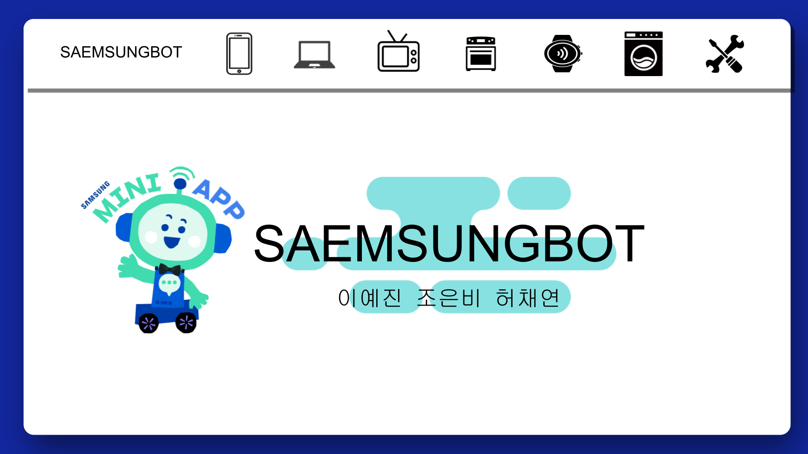
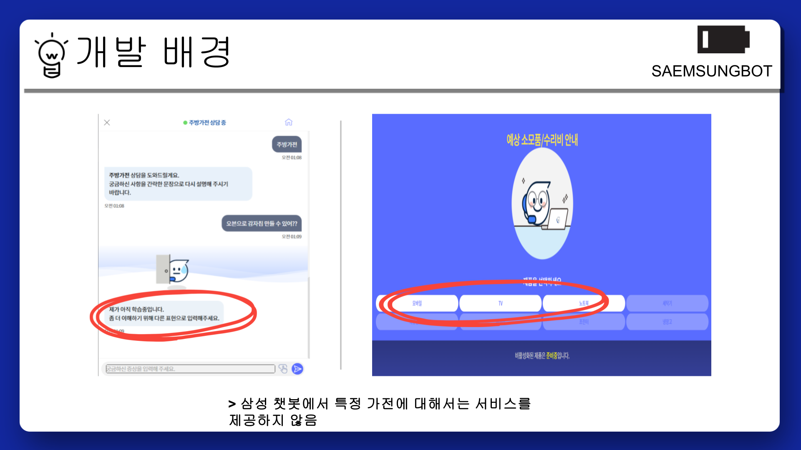
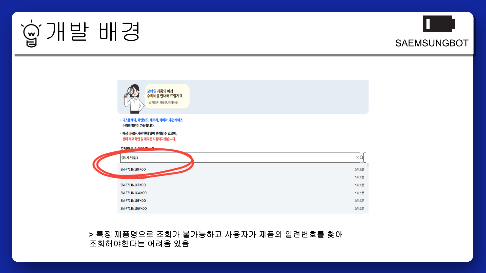
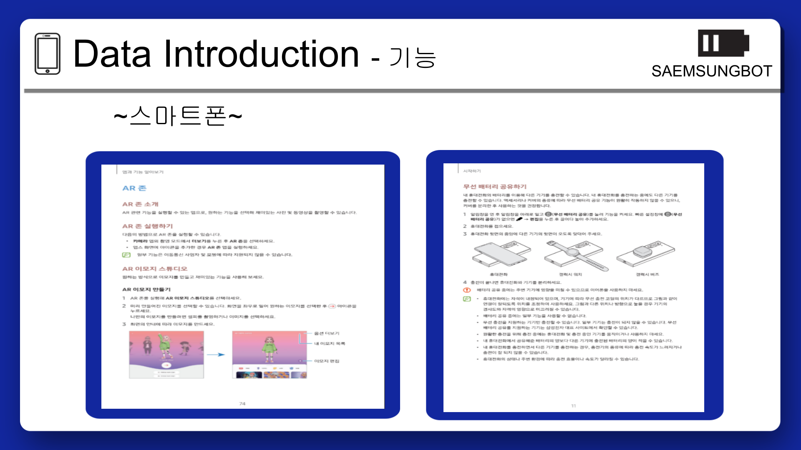
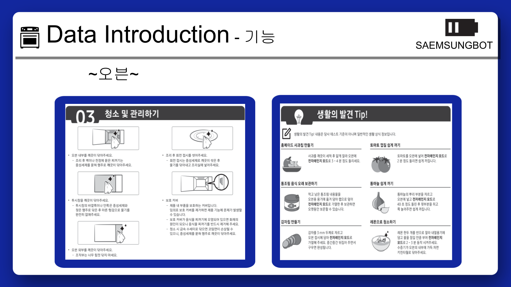
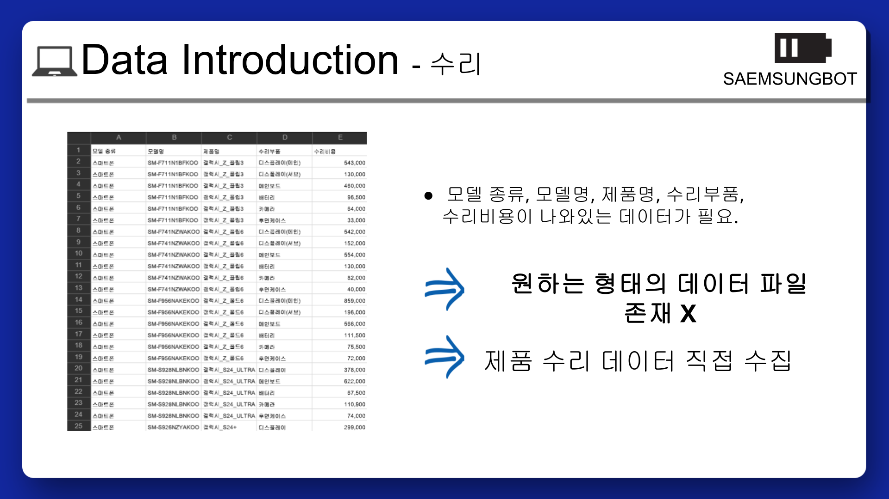
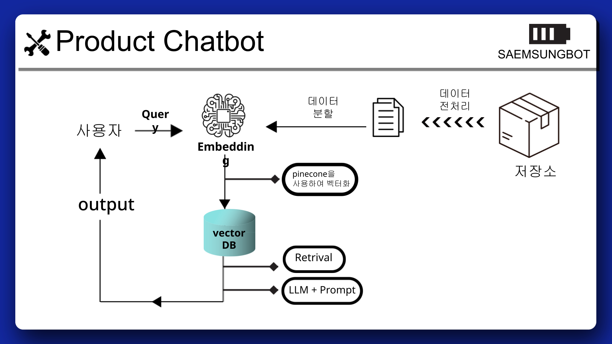
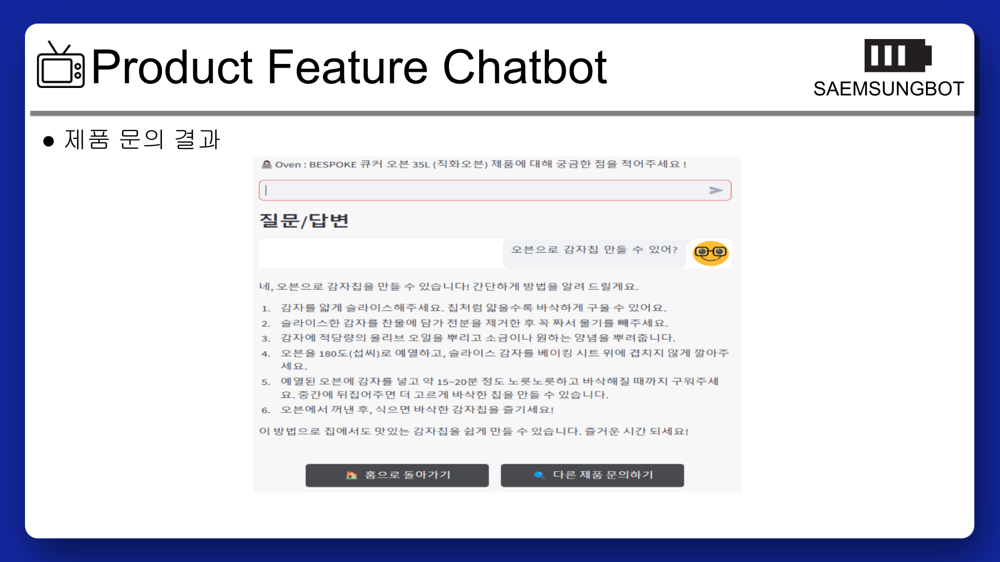
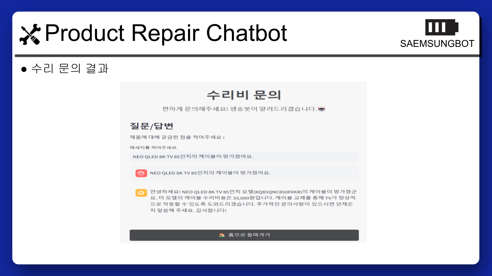

# SAEMSUNGBOT | LLM RAG 기반 챗봇

**프로젝트 이름** : SAEMSUNGBOT

**팀 이름** : SAEMSUNGBOT(샘숭이)

**프로젝트 개요** : 더 편리한 제품 안내를 위한 챗봇, SAEMSUNGBOT

--------

### **개발 배경**
1. 기존 삼성 챗봇은 제품의 일련번호를 찾아 조회해야 한다는 번거로움이 있다. 일련번호, 제품명 모두 검색이 가능하게 해서 접근성을 높이고 싶었다.
2. 정해진 질문만을 선택해야 하거나, 답변의 범위가 제한돼 있다.
3. 수리비도 일부 제품을 제외하고는 찾아보기가 어렵다.

### **개발 목적**

**따라서 검색을 더 편리하게 할 수 있고, 더 깊은 정보를 얻을 수 있는 챗봇을 만들고자 했다.**

-------

### **프로젝트 소개**
- 프로젝트 기간 : 2024.12.18 ~ 12.20
- 팀원 : 이예진, 조은비, 허채연
- 목적 : 개선된 챗봇 '샘숭이' 개발

--------
### **데이터 취득 및 전처리**

**데이터셋** 
- 삼성전자에 올라온 제품별 사용설명서 PDF 파일
- 삼성전자에 게시된 모델명, 제품명, 제품별 부품 가격 등을 직접 찾고, 옮겨적어서 제작한 CSV 파일

**제품별 사용설명서 PDF 파일 예시**

**수리비 CSV 파일 예시**

-----

### **프롬프트 흐름도**

-----

### **챗봇 응답 - Product_Feature_Chatbot**

-----

### **챗봇 응답 - Product_Repair_Chatbot**

-----
### **시연 영상**

-----

### **기대 효과**

더 상세해진 답변, 더 편리해진 서비스
- 제품 사용방법, 수리비 문의에 대해 더 상세한 답변이 가능해집니다.
- 기존에 OPEN AI, 삼성 챗봇 써비가 답변하지 못했던 내용도 해주는 것을 확인할 수 있었습니다.
- 이는 사용자들이 더 편리하게 서비스를 사용할 수 있도록 돕습니다.

  
----
### **소감**

**예진**
- 

**은비**
- 

**채연**
- 

---------

